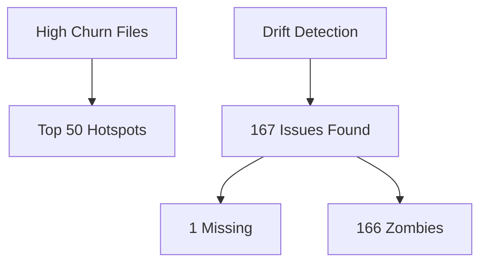

# Pipeline Diagnostics Report

**Run Time:** 2025-11-28T15:28:32.404Z to 2025-11-28T15:30:51.510Z (139.11s)
**Overall Health Score:** 7.21/100

## Key Metrics

- **totalCommits**: 3
- **totalSymbols**: 3137
- **totalEdges**: 20365
- **totalDriftIssues**: 167
- **unresolvedCallers**: 0
- **totalHotspots**: 50
- **bundleIncompleteness**: 167
- **patternDrift**: 9
- **totalLegacyDead**: 21
- **llmTotalCalls**: 6
- **llmTotalTokens**: 0
- **overallHealthScore**: 7.21

## Step Details

### workspace_overlay

- **Hash:** 6f4c674ad8a67f658fee75b6d68e0509b421ba86
- **Status:** no baseline
- **Summary:** staged: files=32, symbols=331 | unstaged: files=35, symbols=378
- **Timestamp:** 2025-11-28T15:28:41.692Z
- **Duration:** 9287ms
- **Metrics:**
  - stagedFiles: 32
  - stagedSymbols: 331
  - unstagedFiles: 35
  - unstagedSymbols: 378

### scope

- **Hash:** fbea42e15b55401cff876c07fab431bf20984004
- **Status:** no baseline
- **Summary:** files=142, working=57, blast=0
- **Timestamp:** 2025-11-28T15:28:41.725Z
- **Duration:** 9320ms
- **Metrics:**
  - commitFiles: 142
  - workingChanged: 57
  - blastRadiusFiles: 0
  - allPaths: 93

### working

- **Hash:** 6976bd2dcb90f93416f1405f141d519c493b4dee
- **Status:** no baseline
- **Summary:** symbols=2412, edges=20365, paths=90
- **Timestamp:** 2025-11-28T15:28:42.324Z
- **Duration:** 598ms
- **Metrics:**
  - symbols: 2412
  - edges: 20365
  - analyzedPaths: 90

### index_commits

- **Hash:** 9a7069cbee1201c74d21ab98074e2ae7c337c213
- **Status:** no baseline
- **Summary:** commits=3
- **Timestamp:** 2025-11-28T15:29:36.377Z
- **Duration:** 54652ms
- **Metrics:**
  - commitCount: 3
  - totalSymbols: 1338
  - totalEdges: 5924

### intended

- **Hash:** f944a2370cca1ae8a40c5d08232070e879a2e1e7
- **Status:** no baseline
- **Summary:** symbols=725, present=511, absent=214, renamed=0
- **Timestamp:** 2025-11-28T15:29:36.415Z
- **Duration:** 38ms
- **Metrics:**
  - totalSymbols: 725
  - present: 511
  - absent: 214
  - renamed: 0

### hotspots

- **Hash:** e040695df35fbf4537606e6e040048225a6574ec
- **Status:** no baseline
- **Timestamp:** 2025-11-28T15:29:41.391Z
- **Duration:** 5003ms
- **Metrics:**
  - topHotspots: 50
  - totalChurn: 0
  - withVersionTracking: 25
  - versionDescriptions: ["3/6 versions","3/6 versions","5/6 versions","4/6 versions","4/6 versions","2/6 versions","2/6 vers

### moved_blocks

- **Hash:** 97d170e1550eee4afc0af065b78cda302a97674c
- **Status:** no baseline
- **Timestamp:** 2025-11-28T15:30:13.529Z
- **Duration:** 37134ms
- **Metrics:**
  - totalMoves: 0
  - withVersionDescription: 0
  - moveTypes: {"rename":0,"relocate":0,"refactor":0}

### drift

- **Hash:** 24c37574f5c91add178d5d755bb6c2fc6b2b6ab9
- **Status:** no baseline
- **Summary:** missing=1, zombies=166, divergent=0, hybrid=0
- **Timestamp:** 2025-11-28T15:30:15.221Z
- **Duration:** 1691ms
- **Metrics:**
  - missing_symbols: 1
  - zombie_symbols: 166
  - divergent_symbols: 0
  - missing_edges: 190
  - zombie_edges: 5661
  - unresolved_callers: 0
  - hybridDrifts: 0
  - conventionDrift: 28
  - mixedConventionFiles: 8

### legacy

- **Hash:** 58e2c4448c9e98b332bce44c68840895ab37de64
- **Status:** no baseline
- **Summary:** dead=21, legacyUsed=0, leftovers=27
- **Timestamp:** 2025-11-28T15:30:17.800Z
- **Duration:** 2578ms
- **Metrics:**
  - dead: 21
  - legacyUsed: 0
  - replacedLeftovers: 27

### bundle_facts

- **Hash:** 21562cad8575c59c7a9795e7b09bb6f426f2c1b9
- **Status:** no baseline
- **Summary:** intended.present=511, absent=214, renamed=0, hybridFacts=0 (0 files)
- **Timestamp:** 2025-11-28T15:30:17.865Z
- **Duration:** 65ms
- **Metrics:**
  - incompleteness: 167
  - patternDrift: 9
  - legacySummary: 21
  - intended: {"present":511,"absent":214,"renamed":0}
  - hybridFactsCount: 0
  - hybridFilesCount: 0

### embedding_index

- **Hash:** n/a (external/complex)
- **Status:** no baseline
- **Timestamp:** 2025-11-28T15:30:50.640Z
- **Duration:** 32773ms

### retrieve_history

- **Hash:** n/a (external/complex)
- **Status:** no baseline
- **Timestamp:** 2025-11-28T15:30:51.022Z
- **Duration:** 382ms
- **Metrics:**
  - historyItems: 3
  - retrievedCommits: 0

### llm_story

- **Hash:** n/a (external/complex)
- **Status:** no baseline
- **Timestamp:** 2025-11-28T15:30:51.509Z
- **Duration:** 487ms
- **Metrics:**
  - storyLength: 1
  - totalHealthScore: 7.205638474295185
  - totalTokens: 0
  - totalCalls: 6
  - blocksCount: 4
- **LLM Summary:**
  - Summary: ## Key Insights

**Refactor Health:** 7/100 🔴

**Quick Stats:** 3 commits, 2412 symbols analyzed, 188 issues (0 high-priority actions)
...
  - Health Score: 7.205638474295185/100
  - Blocks: 4

## LLM Analysis Summaries

### Summary 1

## Key Insights

**Refactor Health:** 7/100 🔴

**Quick Stats:** 3 commits, 2412 symbols analyzed, 188 issues (0 high-priority actions)

#### Full Markdown Output

# LLM Analysis Report

**Generated:** 11/28/2025, 9:30:51 AM

**Bundle:** 3 commits

## Refactor Intent & Story

## Drift Verification

## Cleanup Plan

## LLM-Driven Pattern Discovery

**Metadata:**
- Health Score: 7.205638474295185/100
- LLM Calls: 6
- Model: x-ai/grok-4.1-fast:free
- Validated Evidence: 0
- Analysis Blocks: 4
- Generated: 2025-11-28T15:30:51.504Z

## Visualization

## Summary

- **Total Steps:** 13
- **Errors:** 0
- **Total Symbols:** 3137
- **Total Edges:** 20365
- **Drift Issues:** 167

*Generated by pipeline diagnostics at 2025-11-28T15:30:51.512Z*
