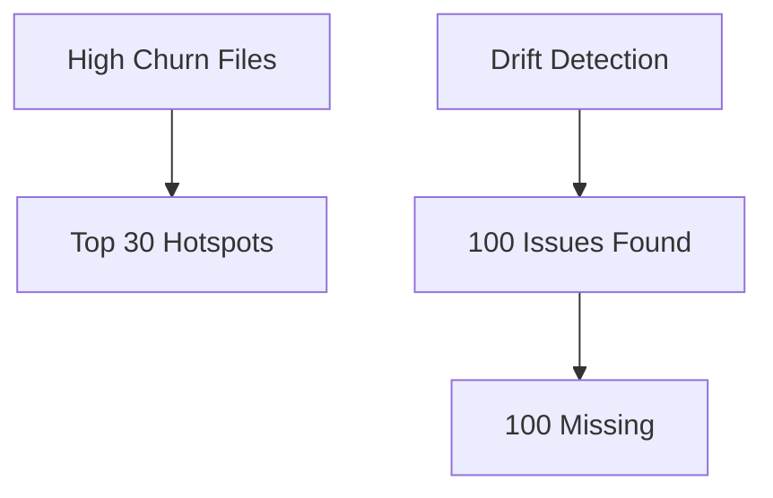

# Pipeline Diagnostics Report

**Run Time:** 2025-11-28T13:16:28.718Z to 2025-11-28T13:16:53.733Z (25.01s)
**Overall Health Score:** 0.00/100

## Key Metrics

- **totalCommits**: 3
- **totalSymbols**: 2274
- **totalEdges**: 14630
- **totalDriftIssues**: 100
- **unresolvedCallers**: 0
- **totalHotspots**: 30
- **bundleIncompleteness**: 100
- **patternDrift**: 8
- **totalLegacyDead**: 20
- **llmTotalCalls**: 6
- **llmTotalTokens**: 0
- **overallHealthScore**: 0.00

## Step Details

### scope

- **Hash:** 21be5a4f63f640cfe86c9c10f026ba8ff0e44912
- **Status:** no baseline
- **Summary:** files=172, working=42, blast=0
- **Timestamp:** 2025-11-28T13:16:29.571Z
- **Duration:** 842ms
- **Metrics:**
  - commitFiles: 172
  - workingChanged: 42
  - blastRadiusFiles: 0
  - allPaths: 68

### workspace_overlay

- **Hash:** eb3eb91be991ed15d63a1964c7e128177b2d5e3a
- **Status:** no baseline
- **Summary:** staged: files=0, symbols=0 | unstaged: files=42, symbols=380
- **Timestamp:** 2025-11-28T13:16:37.400Z
- **Duration:** 8680ms
- **Metrics:**
  - stagedFiles: 0
  - stagedSymbols: 0
  - unstagedFiles: 42
  - unstagedSymbols: 380

### working

- **Hash:** d1e5847541791a8ed2563dc9503899b7d9c32e92
- **Status:** no baseline
- **Summary:** symbols=2174, edges=14630, paths=68
- **Timestamp:** 2025-11-28T13:16:41.714Z
- **Duration:** 4314ms
- **Metrics:**
  - symbols: 2174
  - edges: 14630
  - analyzedPaths: 68

### index_commits

- **Hash:** d1ef2761764aaf307ab3ae16ec6673da9d69078d
- **Status:** no baseline
- **Summary:** commits=3
- **Timestamp:** 2025-11-28T13:16:46.963Z
- **Duration:** 9563ms
- **Metrics:**
  - commitCount: 3
  - totalSymbols: 0
  - totalEdges: 0

### intended

- **Hash:** 6fdc1043e3238bb3497a13b5ac4c851047f62734
- **Status:** no baseline
- **Summary:** symbols=100, present=100, absent=0, renamed=0
- **Timestamp:** 2025-11-28T13:16:46.969Z
- **Duration:** 5ms
- **Metrics:**
  - totalSymbols: 100
  - present: 100
  - absent: 0
  - renamed: 0

### moved_blocks

- **Hash:** 97d170e1550eee4afc0af065b78cda302a97674c
- **Status:** no baseline
- **Timestamp:** 2025-11-28T13:16:46.978Z
- **Duration:** 11ms
- **Metrics:**
  - totalMoves: 0
  - withVersionDescription: 0
  - moveTypes: {"rename":0,"relocate":0,"refactor":0}

### hotspots

- **Hash:** a8b0374a0aa68b6151ace6cecc936199e26a9482
- **Status:** no baseline
- **Timestamp:** 2025-11-28T13:16:47.255Z
- **Duration:** 290ms
- **Metrics:**
  - topHotspots: 30
  - totalChurn: 0
  - withVersionTracking: 0
  - versionDescriptions: []

### drift

- **Hash:** d1d5f896a4b7315e4999f9713bb3e953166f9f85
- **Status:** no baseline
- **Summary:** missing=100, zombies=0, divergent=0, hybrid=0
- **Timestamp:** 2025-11-28T13:16:47.441Z
- **Duration:** 186ms
- **Metrics:**
  - missing_symbols: 100
  - zombie_symbols: 0
  - divergent_symbols: 0
  - missing_edges: 0
  - zombie_edges: 0
  - unresolved_callers: 0
  - hybridDrifts: 0
  - conventionDrift: 26
  - mixedConventionFiles: 7

### legacy

- **Hash:** 49f141671fbc3d187ec3e6c5194ade5d496d4d8c
- **Status:** no baseline
- **Summary:** dead=20, legacyUsed=0, leftovers=0
- **Timestamp:** 2025-11-28T13:16:47.746Z
- **Duration:** 305ms
- **Metrics:**
  - dead: 20
  - legacyUsed: 0
  - replacedLeftovers: 0

### bundle_facts

- **Hash:** 2b97f47ff031a70eb9dda76f623d5223ee9e256e
- **Status:** no baseline
- **Summary:** intended.present=100, absent=0, renamed=0, hybridFacts=0 (0 files)
- **Timestamp:** 2025-11-28T13:16:47.797Z
- **Duration:** 51ms
- **Metrics:**
  - incompleteness: 100
  - patternDrift: 8
  - legacySummary: 20
  - intended: {"present":100,"absent":0,"renamed":0}
  - hybridFactsCount: 0
  - hybridFilesCount: 0

### embedding_index

- **Hash:** n/a (external/complex)
- **Status:** no baseline
- **Timestamp:** 2025-11-28T13:16:52.899Z
- **Duration:** 5102ms

### retrieve_history

- **Hash:** n/a (external/complex)
- **Status:** no baseline
- **Timestamp:** 2025-11-28T13:16:53.328Z
- **Duration:** 429ms
- **Metrics:**
  - historyItems: 0
  - retrievedCommits: 0

### llm_story

- **Hash:** n/a (external/complex)
- **Status:** no baseline
- **Timestamp:** 2025-11-28T13:16:53.732Z
- **Duration:** 404ms
- **Metrics:**
  - storyLength: 1
  - totalHealthScore: 0
  - totalTokens: 0
  - totalCalls: 6
  - blocksCount: 4
- **LLM Summary:**
  - Summary: ## Key Insights

**Refactor Health:** 0/100 🔴

**Quick Stats:** 3 commits, 2174 symbols analyzed, 120 issues (0 high-priority actions)
...
  - Health Score: 0/100
  - Blocks: 4

## LLM Analysis Summaries

### Summary 1

## Key Insights

**Refactor Health:** 0/100 🔴

**Quick Stats:** 3 commits, 2174 symbols analyzed, 120 issues (0 high-priority actions)

#### Full Markdown Output

# LLM Analysis Report

**Generated:** 11/28/2025, 7:16:53 AM

**Bundle:** 3 commits

## Refactor Intent & Story

## Drift Verification

## Cleanup Plan

## LLM-Driven Pattern Discovery

**Metadata:**
- Health Score: 0/100
- LLM Calls: 6
- Model: x-ai/grok-4.1-fast:free
- Validated Evidence: 0
- Analysis Blocks: 4
- Generated: 2025-11-28T13:16:53.728Z

## Visualization

## Summary

- **Total Steps:** 13
- **Errors:** 0
- **Total Symbols:** 2274
- **Total Edges:** 14630
- **Drift Issues:** 100

*Generated by pipeline diagnostics at 2025-11-28T13:16:53.735Z*
