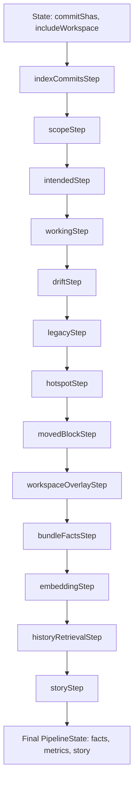

### Analysis Pipeline in Condensed Natural Language

The core analysis pipeline is orchestrated by the [`RefactorPipeline`](src/analysis/refactorPipeline.ts:21) class, which receives an array of `commitShas` (from Cockpit/state) and an `includeWorkspace` flag. It constructs a sequence of modular steps (functions) that process [`PipelineState`](src/analysis/runner/pipelineTypes.ts) sequentially via [`runPipeline`](src/analysis/runner/pipelineRunner.ts:1), each step receiving prior state, computing metrics/facts, and returning updated state.

#### Pipeline Flow (Step-by-Step):

**[`RefactorPipeline`](src/analysis/refactorPipeline.ts:21) class**  
- Receives `commitShas[]`, `includeWorkspace?: boolean` from CockpitOrchestrator/state  
- Instantiates indexers/engines (e.g. [`CommitIndexer`](src/analysis/commitIndexer.ts))  
- Builds step chain, invokes `runPipeline(steps, initialState)`  
- Returns final `PipelineState` (facts, metrics, LLM story) to state/UI  

**1. [`indexCommitsStep`](src/analysis/runner/steps/indexCommitsStep.ts)** (via [`CommitIndexer`](src/analysis/commitIndexer.ts))  
- Receives `commitShas[]` from state  
- Ensures commits indexed: extracts git changes, Tree-sitter symbols/edges, Difftastic diffs per file/blob  
- Computes symDiff, edgeDiff, risks, renames, moves  
- Aggregates commit metrics (churn, hotspots); stores to DB  
- Updates state: `indexedCommits: CommitFacts[]`  

**2. [`scopeStep`](src/analysis/runner/steps/scopeStep.ts)**  
- Receives indexed commits from state  
- Calculates project scope: total symbols, files, subsystems  
- Returns scope metrics to state  

**3. [`intendedStep`](src/analysis/runner/steps/intendedStep.ts)**  
- Receives scope/indexed data  
- Builds `IntendedState` map: expected present/absent symbols per refactor intent  
- Updates state: `intended: Map<string, IntendedState>`  

**4. [`workingStep`](src/analysis/runner/steps/workingStep.ts)**  
- Receives scope/intended  
- Builds `WorkingSnapshot`: current symbols/edges from workspace/commits  
- Updates state: `working: WorkingSnapshot`  

**5. [`driftStep`](src/analysis/runner/steps/driftStep.ts)** (via [`driftDetector`](src/facts/driftDetector.ts))  
- Receives `intended`, `working`  
- Detects drift: missing_symbols, zombie_symbols, divergent_symbols, missing_edges  
- Computes hotspots, conventionDrift  
- Updates state: `drift: DriftFindings`  

**6. [`legacyStep`](src/analysis/runner/steps/legacyStep.ts)** (via [`legacyAuditAdapter`](src/metrics/legacyAuditAdapter.ts))  
- Receives `intended`, `working`, scope  
- Audits legacy: dead symbols, legacyUsed, replacedLeftovers  
- Updates state: `legacy: LegacyAuditMetrics`  

**7. [`hotspotStep`](src/analysis/runner/steps/hotspotStep.ts)**  
- Receives prior state (queries DB)  
- Detects hotspots: high-churn files/symbols, risk concentrations  
- Updates state: `hotspots: Hotspot[]`  

**8. [`movedBlockStep`](src/analysis/runner/steps/movedBlockStep.ts)** (via [`movedBlockAdapter`](src/metrics/movedBlockAdapter.ts))  
- Receives symDiffs (queries DB)  
- Detects moved blocks/symbol renames, file moves  
- Updates state: `movedBlocks: MovedBlockMetrics`  

**9. [`workspaceOverlayStep`](src/analysis/runner/steps/workspaceStep.ts)** (via [`WorkspaceIndexer`](src/analysis/workspaceIndexer.ts))  
- Receives `includeWorkspace` flag  
- If true: analyzes staged/unstaged vs HEAD (Tree-sitter + optional Difftastic)  
- Computes workspace symDiff/edgeDiff/risks  
- Updates state: `workspaceFacts?: WorkspaceFacts`  

**10. [`bundleFactsStep`](src/analysis/runner/steps/bundleFactsStep.ts)** (via [`factsAssembler`](src/facts/factsAssembler.ts))  
- Receives all prior: drift, legacy, hotspots, movedBlocks, workspace  
- Assembles bundle facts: incompleteness counts, patternDrift, legacyAudit summary  
- Updates state: `bundleFacts: BundleFacts`  

**11. [`embeddingStep`](src/analysis/runner/steps/embeddingStep.ts)** (via [`EmbeddingIndexer`](src/analysis/embeddingIndexer.ts))  
- Receives bundleFacts  
- Generates story shards (commit/symbol/theme), embeds via Quant  
- Stores vectors (Qdrant)  
- Updates state: `embeddings: EmbeddingMetadata[]`  

**12. [`historyRetrievalStep`](src/analysis/runner/steps/historyStep.ts)** (via [`BundleStoryEngine`](src/analysis/bundleStoryEngine.ts))  
- Receives embeddings  
- Queries similar commits/symbols/drift episodes  
- Updates state: `retrievedHistory: RetrievedHistory[]`  

**13. [`storyStep`](src/analysis/runner/steps/storyStep.ts)** (via [`BundleStoryEngine`](src/analysis/bundleStoryEngine.ts))  
- Receives bundleFacts + retrievedHistory  
- Runs LLM multi-pass: intent/story, drift verification, cleanup plan  
- Updates state: `story: {story, drift, problems, plan}`  

Final state sent back to CockpitOrchestrator for UI rendering. Cross-cutting: blastRadius, riskDetection integrated in index/risk steps; patternDrift in factsAssembler.

This matches README.md high-level (git data → Tree-sitter → Difftastic → graph → risks → LLM → DB) but granularized into testable steps. Benchmarks confirm order via [pipeline_metric_test.ts](benchmarks/pipeline_metric_test.ts).