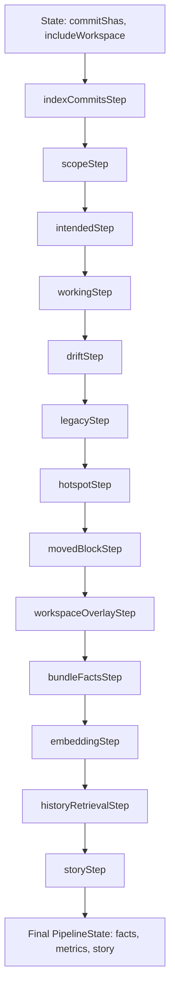

### Analysis Pipeline in Condensed Natural Language

The core analysis pipeline is orchestrated by the [`RefactorPipeline`](src/analysis/refactorPipeline.ts:21) class, which receives an array of `commitShas` (from Cockpit/state) and an `includeWorkspace` flag. It constructs a sequence of modular steps (functions) that process [`PipelineState`](src/analysis/runner/pipelineTypes.ts) via [`runPipeline`](src/analysis/runner/pipelineRunner.ts:1), which uses **dependency-based topological sorting** to execute steps in parallel within dependency levels. Each step receives prior state, computes metrics/facts, and returns updated state.

**Note:** Steps with no dependencies (`deps: []`) can run in parallel. Steps are executed level-by-level based on dependency graph, enabling parallel execution within each level. Steps 11-13 (embedding, history retrieval, story) are **conditional** and can be skipped via pipeline configuration (`skipEmbedding`, `skipLLM`).

#### Pipeline Flow (Step-by-Step):

**[`RefactorPipeline`](src/analysis/refactorPipeline.ts:21) class**  
- Receives `commitShas[]`, `includeWorkspace?: boolean` from CockpitOrchestrator/state  
- Instantiates indexers/engines (e.g. [`CommitIndexer`](src/analysis/commitIndexer.ts))  
- Builds step chain, invokes `runPipeline(steps, initialState)`  
- Returns final `PipelineState` (facts, metrics, LLM story) to state/UI  

**1. [`indexCommitsStep`](src/analysis/runner/steps/indexCommitsStep.ts)** (via [`CommitIndexer`](src/analysis/commitIndexer.ts))  
- **Dependencies:** None (`deps: []`) - can run in parallel with other independent steps  
- Receives `commitShas[]` from state  
- Ensures commits indexed: extracts git changes, Tree-sitter symbols/edges, Difftastic diffs per file/blob  
- Computes symDiff, edgeDiff, risks, renames, moves  
- Aggregates commit metrics (churn, hotspots); stores to DB  
- Uses configurable concurrency (default 8) for parallel commit processing  
- Updates state: `commitFacts: CommitFacts[]`  

**2. [`scopeStep`](src/analysis/runner/steps/scopeStep.ts)**  
- **Dependencies:** None (`deps: []`) - can run in parallel with index_commits  
- Receives `commitShas[]` and `includeWorkspace` flag from state  
- Calculates analysis scope: commit files, working tree changes (staged/unstaged), blast radius neighbors, and union of all paths  
- Returns `ScopeSet` to state: `scope: { commitFiles, workingChanged, blastRadius, allPaths }`  

**3. [`intendedStep`](src/analysis/runner/steps/intendedStep.ts)**  
- **Dependencies:** None (`deps: []`) - independent, doesn't require scope  
- Receives `commitShas[]` from state  
- Builds `IntendedState` map: expected present/absent symbols per refactor intent by analyzing commit history  
- Updates state: `intended: Map<string, IntendedState>`  

**4. [`workingStep`](src/analysis/runner/steps/workingStep.ts)**  
- **Dependencies:** `scope` (`deps: ['scope']`)  
- Receives `scope.allPaths` from state  
- Builds `WorkingSnapshot`: current symbols/edges from workspace files (uses `scope.allPaths` to determine which files to analyze)  
- Updates state: `working: WorkingSnapshot`  

**5. [`driftStep`](src/analysis/runner/steps/driftStep.ts)** (via [`driftDetector`](src/facts/driftDetector.ts))  
- **Dependencies:** `intended`, `working` (`deps: ['intended', 'working']`)  
- Receives `intended`, `working`, and `commitShas[]` from state  
- Detects drift: missing_symbols, zombie_symbols, divergent_symbols, missing_edges, zombie_edges, conventionDrift, divergentClusters, **unresolved_callers**  
- **UnresolvedCaller detection**: Finds call sites (edges with type 'calls') where the target doesn't resolve to a known symbol. Scans all call edges, checks if `edge.to_symbol_id` exists in working symbols. Attempts to guess targets by name matching (case-insensitive), calculates severity based on occurrence count (logarithmic scale). Higher severity if no guessed target found. Identifies broken references, missing dependencies, or incomplete refactors.  
- Computes convention drift analysis and divergent symbol clusters  
- Updates state: `drift: DriftFindings`  

**6. [`legacyStep`](src/analysis/runner/steps/legacyStep.ts)** (via [`legacyAudit`](src/facts/legacyAudit.ts))  
- **Dependencies:** `intended`, `working`, `scope` (`deps: ['intended', 'working', 'scope']`)  
- Receives `intended`, `working`, and `scope` from state  
- Audits legacy: dead symbols, legacyUsed, replacedLeftovers  
- Updates state: `legacy: LegacyAuditResult`  

**7. [`hotspotStep`](src/analysis/runner/steps/hotspotStep.ts)**  
- **Dependencies:** None (`deps: []`) - independent, queries DB directly  
- Receives `commitShas[]` from state  
- Updates hotspot metrics by querying DB for symbols per commit, joining with symbol_versions to get dna_id  
- Updates file and symbol hotspot scores via HotspotDetector  
- Stores top 25 file and symbol hotspots in state: `hotspots: Array<FileHotspot | SymbolHotspot>`  

**8. [`movedBlockStep`](src/analysis/runner/steps/movedBlockStep.ts)** (via [`MovedBlockDetector`](src/analysis/movedBlockDetector.ts))  
- **Dependencies:** `index_commits` (`deps: ['index_commits']`)  
- Receives `commitShas[]` from state  
- Queries DB for symbols with change_type 'removed' or 'added' per commit  
- Retrieves full symbol data from file_snapshots for location info  
- Detects moved code blocks by comparing deleted and added symbols using MovedBlockDetector  
- Stores top 50 moved blocks in state: `movedBlocks: MovedBlock[]`  

**9. [`workspaceOverlayStep`](src/analysis/runner/steps/workspaceStep.ts)** (via [`WorkspaceIndexer`](src/analysis/workspaceIndexer.ts))  
- **Dependencies:** None (`deps: []`) - independent, checks flag internally  
- Receives `includeWorkspace` flag from state  
- If `includeWorkspace` is true: analyzes unstaged changes first (priority), falls back to staged if unstaged has no changes  
- Uses WorkspaceIndexer to compute workspace symDiff/edgeDiff/risks (Tree-sitter + optional Difftastic)  
- WorkspaceIndexer analyzes working directory changes vs HEAD, extracts symbols and dependencies from modified files  
- Updates state: `workspaceFacts?: WorkspaceFacts` (or `null` if `includeWorkspace` is false)  

**10. [`bundleFactsStep`](src/analysis/runner/steps/bundleFactsStep.ts)** (via [`factsAssembler`](src/facts/factsAssembler.ts))  
- **Dependencies:** `scope`, `intended`, `working`, `drift`, `legacy`, `hotspots` (`deps: ['scope', 'intended', 'working', 'drift', 'legacy', 'hotspots']`)  
- Receives `commitFacts`, `workspaceFacts`, and all computed facts from state  
- Assembles bundle facts: incompleteness counts, patternDrift, legacyAudit summary  
- Can work with partial facts (has fallback logic if some facts are missing)  
- Updates state: `bundleFacts: RefactorBundleFacts`  

**11. [`embeddingStep`](src/analysis/runner/steps/embeddingStep.ts)** (via [`EmbeddingIndexer`](src/analysis/embeddingIndexer.ts))  
- **Dependencies:** `bundle_facts` (`deps: ['bundle_facts']`) - **Conditional** (can be skipped via `skipEmbedding`)  
- Receives `commitFacts` from state  
- Generates story shards (commit/symbol/theme), embeds via configured embedding provider  
- Stores vectors in Qdrant  
- Note: Embedding metadata is stored in Qdrant, not directly in state  

**12. [`historyRetrievalStep`](src/analysis/runner/steps/historyStep.ts)** (via [`BundleStoryEngine`](src/analysis/bundleStoryEngine.ts))  
- **Dependencies:** `bundle_facts` (`deps: ['bundle_facts']`) - **Conditional** (can be skipped via `skipEmbedding`)  
- Receives `bundleFacts` and `commitFacts` from state  
- Uses BundleStoryEngine to retrieve cross-time history  
- Generates embeddings internally if needed, then queries Qdrant for similar commits/symbols/drift episodes  
- Updates state: `history: RetrievedHistory[]`  

**13. [`storyStep`](src/analysis/runner/steps/storyStep.ts)** (via [`BundleStoryEngine`](src/analysis/bundleStoryEngine.ts))  
- **Dependencies:** `bundle_facts`, `retrieve_history`, `embedding_index` (`deps: ['bundle_facts', 'retrieve_history', 'embedding_index']`) - **Conditional** (can be skipped via `skipLLM`)  
- Receives `bundleFacts` and `commitFacts` from state  
- Runs LLM multi-pass analysis via BundleStoryEngine: intent/story, drift verification, cleanup plan  
- Updates state: `llmOutputs: LlmAnalysis` (contains summary, blocks, markdown, metadata)  

Final state (including `bundleFacts`, optional `llmOutputs`, `history`, etc.) is sent back to CockpitOrchestrator for UI rendering. Cross-cutting concerns like blastRadius and riskDetection are integrated in index/risk steps; patternDrift is computed in factsAssembler.

This matches README.md high-level (git data → Tree-sitter → Difftastic → graph → risks → LLM → DB) but granularized into testable, dependency-based steps with parallel execution capabilities. Benchmarks confirm order and dependencies via [pipeline_metric_test.ts](benchmarks/pipeline_metric_test.ts).

---

## Live Change Tracking System

**Separate from main pipeline** - runs independently in VS Code extension

### [`LiveDiffTracker`](src/liveTracker.ts)
- Tracks unsaved editor changes in real-time using `onDidChangeTextDocument`
- Buffers changes per file with debouncing (configurable threshold)
- Monitors file extensions via `git-context.live.extensions` config
- Uses incremental symbol parsing via `SymbolExtractor.extractIncremental()`
- Emits `changesUpdated` events when thresholds are met (lines or symbols)
- Resets buffers on file save (`onDidSaveTextDocument`)
- Configurable thresholds: `git-context.live.thresholds.lines` (default 50), `git-context.live.thresholds.symbols` (default 5)
- Auto-runs analysis after N edits (`git-context.live.autoRunAfterEdits`, default 50)

### [`LiveAnalysisEngine`](src/analysis/liveAnalysis.ts)
- Analyzes live changes against existing bundle facts
- Requires active bundle facts from CockpitOrchestrator state
- Reconstructs intended state from bundle facts (database or evidence-based fallback)
- Gets live content overrides from LiveDiffTracker
- Runs drift and legacy detection on live state
- Updates CockpitOrchestrator live state with analysis results
- Provides summary: missing, zombies, drift, dead symbol counts

**Integration:**
- Initialized in `extension.ts` alongside main pipeline
- Subscribes to `LiveDiffTracker` events for UI updates
- Accessible via `git-context.generateLiveReport` command
- State synchronized with Cockpit UI Live tab

---

## Supporting Systems

### Symbol DNA Tracking ([`symbolDna.ts`](src/analysis/symbolDna.ts))
- Generates stable DNA hash for symbols (survives renames, moves)
- Based on: kind + signature + body shape (not name, not location)
- Used by hotspot and moved block detection to track symbols across changes
- Enables symbol identity matching even after refactoring

### Context Export ([`contextExporter.ts`](src/analysis/contextExporter.ts))
- Generates structured LLM context reports in JSON format
- Token budgeting and deterministic truncation (max ~12k tokens)
- Includes commit context, file context, symbol context, edge context
- Generates Mermaid dependency graphs
- Performs legacy audit for context reports
- Used for exporting analysis data for external LLM consumption

### Visualization ([`mermaidGenerator.ts`](src/analysis/mermaidGenerator.ts))
- Generates Mermaid graph visualizations for dependency graphs
- Filters to most relevant edges (configurable max nodes)
- Highlights changed symbols
- Used in reports and context export

### Concurrency ([`runner/concurrency.ts`](src/analysis/runner/concurrency.ts))
- Utility for running multiple async tasks with concurrency limit
- Used by commit indexing for parallel commit processing
- Implements worker pool pattern with configurable limit

---

## Architectural Details

### Caching Strategy
- **Content-addressed caching**: Commits cached by content hash, not SHA
- **Structural diff caching**: Diffs cached by blob SHA pairs
- **Cache performance tracking**: Optional cache hit/miss statistics per step
- **Cache TTL**: Configurable (default 3600 seconds)
- Enables 3-6x faster commit indexing on re-analysis

### Database Integration
- Steps query/update database via `getDatabaseManager()`
- Symbol versioning: `symbol_versions` table tracks DNA IDs across commits
- Blob snapshot storage: `file_snapshots` table stores full file content and symbols
- Hotspot and moved block steps query DB directly for symbol data
- Embedding vectors stored in Qdrant (external vector database)

### UI Integration
- **CockpitOrchestrator**: Singleton state manager for VS Code extension
- Receives pipeline state updates via `updateState()` calls
- Manages webview communication with Cockpit UI
- Tracks analysis progress, errors, and results
- Live state synchronized with LiveDiffTracker events
- State changes trigger UI updates via event emission

### CLI & Hooks
- **Git Hooks** ([`cli/hooks.ts`](src/cli/hooks.ts)): Automatically trigger analysis on commits
- **CLI Queries** ([`cli/queries.ts`](src/cli/queries.ts)): Command-line interface for querying analysis data
- **CLI Analyze** ([`cli/analyze.ts`](src/cli/analyze.ts)): Standalone analysis mode
- **CLI Index** ([`cli/index.ts`](src/cli/index.ts)): Entry point for CLI commands
- Can run analysis outside VS Code for CI/CD or automation