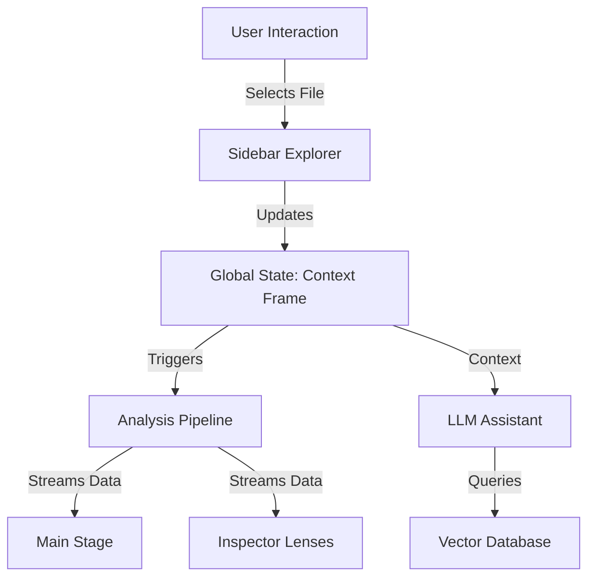

# Unified UI Master Plan: The "Super Webview"

**Version**: 2.1 (Gap-Filled)
**Status**: Approved for Implementation
**Goal**: Unify the "Cockpit" (Selection) and "Report" (Analysis) into a single, context-centric interface.

---

## 1. Executive Summary

The current UI splits the user's mental model into "Setup" (Cockpit) and "Results" (Report). This friction reduces engagement. The **Unified UI** removes this split by treating the entire experience as a single "Window" that zooms in and out of the codebase.

### The Core Shift
*   **Old Model**: Select Commits -> Run Analysis -> Open Report Tab -> Read Static Markdown.
*   **New Model**: Open Webview -> Navigate File Tree -> View Live Analysis -> Ask Questions.

---

## 2. Architecture Specification

### High-Level Data Flow



### Component Hierarchy

```text
SuperWebview (Main Container)
├── Sidebar (Left)
│   ├── FileTree (Recursive)
│   └── FilterBar (Search/Status)
├── MainArea (Center)
│   ├── Breadcrumbs (Navigation)
│   ├── Stage (Visualization Switcher)
│   │   ├── BundleStage (Level 1: Heatmap + Config)
│   │   ├── BlastRadiusStage (Level 2: Graph)
│   │   ├── FileStage (Level 3: Structure)
│   │   └── SymbolStage (Level 4: Code/Diffs)
│   └── Assistant (Bottom Overlay)
└── Inspector (Right)
    ├── LensTabs (Timeline, Drift, Relations, Risk)
    └── LensContent (Data Visualization)
```

---

## 3. State Management (TypeScript Interfaces)

The entire UI is driven by the `ContextFrame`.

```typescript
// The core unit of navigation
export interface ContextFrame {
  level: 'bundle' | 'blast_radius' | 'file' | 'symbol';
  id: string;          // path or symbol_id
  name: string;        // display name
  status: 'ready' | 'scanning' | 'unknown';
  data?: any;          // cached analysis data
}

// The global store
export interface SuperWebviewState {
  activeFrame: ContextFrame;
  history: ContextFrame[]; // For "Back" navigation
  selection: Selection | null;
  explorerData: ExplorerNode[]; // The file tree structure
  config: {
    depth: number;       // Number of commits to analyze
    includeStaged: boolean;
    includeUnstaged: boolean;
  };
}

// Selection within a frame (e.g., clicking a node in the graph)
export interface Selection {
  type: 'node' | 'edge' | 'line';
  id: string;
  metadata: any;
}
```

---

## 4. Detailed User Flows

### Scenario A: Investigating a "Drift" Warning (Top-Down)

1.  **Entry**: User clicks "Open Git Context" from the VS Code Status Bar.
2.  **Bundle View (Level 1)**:
    *   **Visual**: A Heatmap of the repo shows `src/auth/` glowing red (High Churn).
    *   **Inspector**: Shows "Top Risks: Naming Drift in `auth.ts`".
3.  **Zoom In**: User double-clicks the red `auth` block.
4.  **File View (Level 3)**:
    *   **Visual**: The Stage shows the structure of `auth.ts`.
    *   **Visual**: The `login()` method has a "Drift" badge.
    *   **Inspector**: Updates to "File History".
5.  **Drill Down**: User clicks `login()`.
6.  **Symbol View (Level 4)**:
    *   **Visual**: Shows the code for `login()`.
    *   **Inspector**: Shows the **Drift Lens**: "Parameter `user_id` violates convention `userId`".
7.  **Action**: User clicks "Fix" in the Assistant.

### Scenario B: Selection-First (Bottom-Up)

1.  **Entry**: User is editing `database.ts` in VS Code. They run command `Git Context: Open Current File`.
2.  **File View (Level 3)**:
    *   The Webview opens directly to `database.ts`.
    *   **Status**: Shows "Scanning..." skeleton while fetching data.
3.  **Discovery**:
    *   User sees a "Broken Edge" icon on `connect()`.
4.  **Blast Radius (Level 2)**:
    *   User clicks the "Blast Radius" button.
    *   **Visual**: Shows `connect()` is called by `legacy_init()` which is marked "Dead Code".
5.  **Resolution**: User deletes `legacy_init()`.

---

## 5. Technical Strategy

### Data Fetching Strategy
To ensure responsiveness, we use a **Tiered Fetching** approach:

1.  **Tier 1: Structure (Instant)**
    *   Source: `WorkspaceIndexer` (CST).
    *   Data: File tree, symbol names, basic signatures.
    *   Display: Explorer tree, Skeleton Stage.

2.  **Tier 2: Hybrid Metadata (Fast)**
    *   Source: `WorkspaceIndexer` (Hybrid Facts) + `git log`.
    *   Data: **Virtual Commits** (Staged/Unstaged), Drift Indicators (Heuristic-based), Churn.
    *   Display: Heatmap colors, Timeline (Virtual + Head), Drift Badges.

3.  **Tier 3: Semantics (Slow/Streamed)**
    *   Source: `TreeSitter` + `Difftastic` + `LLM`.
    *   Data: Semantic diffs, deep drift analysis, risk scores.
    *   Display: Inspector details, Assistant insights.

### Live Analysis Implementation
We will use a `FileSystemWatcher` in the extension host to trigger updates.

```typescript
// src/watchers/LiveWatcher.ts
vscode.workspace.onDidChangeTextDocument(e => {
  if (activeFrame.id === e.document.fileName) {
    // 1. Debounce (500ms)
    // 2. Re-run local CST parse (Hybrid Facts)
    // 3. Send 'updateFrame' message to Webview
  }
});
```

---

## 6. Implementation Roadmap

### Phase 1: Prototype (Completed)
*   [x] **Goal**: Validate UX concepts.
*   [x] **Deliverable**: `SuperWebview` component with mock data.

### Phase 2: Data Integration (The "Deep Dive" Tool)
*   [x] **Goal**: Connect real data to the Explorer and Stage.
*   [x] **Step 2.1**: Implement `getExplorerTree()` in `CockpitProvider`.
    *   *Implementation*: Refactored into `ExplorerController` and `ExplorerService`. Supports multiple bundles and "New Bundle" node.
*   [x] **Step 2.2**: Implement `ContextFrame` hydration.
    *   *Implementation*: `analyzeFrame` now fetches facts from `BundleFacts` or falls back to live `TreeSitterParser` scanning.
*   [x] **Step 2.3**: Connect **Timeline Lens** with **Virtual Commits**.
    *   *Implementation*: `GitOperations` injects staged/unstaged changes as virtual commits.

### Phase 3: The "Bundle" Expansion
*   [x] **Goal**: Replicate Cockpit features in Level 1.
*   [x] **Step 3.1**: Add **Depth & Scope Configuration** to Bundle Stage.
    *   *Implementation*: `BundleManager` handles CRUD for `bundles` table. `BundleConfig` supports roots, exclusions, and mode.
*   [ ] **Step 3.2**: Add "Repo Stats" to Inspector.

### Phase 4: Convergence
*   **Goal**: Replace the legacy Cockpit.
*   **Step 4.1**: Set `SuperWebview` as default.
*   **Step 4.2**: Remove legacy `Cockpit` code.

---

## 7. The Four Zones: Detailed Breakdown

### A. The Explorer (Left Sidebar)

#### Purpose
Persistent navigation tree that provides spatial awareness and status visibility.

#### Features
*   **Hierarchical Tree**: Files -> Classes -> Functions
*   **Status Indicators**:
    *   🟢 **Ready**: Full analysis complete
    *   🟡 **Scanning**: Analysis in progress (pulsing animation)
    *   ⚪ **Unknown**: Not yet analyzed
*   **Badges**: Show drift count, hotspot level, broken edges
*   **Search**: Filter by name, status, or risk level
*   **Context Menu**: "Open in Editor", "Analyze Now", "Export Report"

### B. The Stage (Center Visualization)

#### Level 1: Bundle Stage
*   **Visual**: Treemap or Heatmap of repository
*   **Colors**: Green (low churn) -> Yellow (medium) -> Red (high churn)
*   **Interaction**: Click to zoom to File or Blast Radius
*   **Dynamic Scope Builder**:
    *   **Roots**: Add/Remove specific directories or files (e.g., `src/auth/`, `utils.ts`).
    *   **Smart Expansion**: "Include Connected Set" checkbox (pulls in callers/callees of selected roots).
    *   **Presets**:
        *   "My Changes" (Staged + Unstaged files)
        *   "Current Module" (Directory of active file)
        *   "Full Repo"
    *   **Exclusions**: Glob patterns to ignore (e.g., `**/*.test.ts`).
*   **Configuration**:
    *   **Depth Selector**: "Last N Commits" (Slider/Input)
    *   **Commit Selection**: Checkboxes for specific commits

#### Level 2: Blast Radius Stage
*   **Visual**: Force-directed graph (D3.js or similar)
*   **Nodes**: Central file + neighbors (callers/callees)
*   **Edges**: Calls (solid), Imports (dashed)
*   **Colors**:
    *   Central: Blue
    *   Direct neighbors: Green
    *   Broken edges: Red
*   **Interaction**: Click node to zoom to File view

#### Level 3: File Stage
*   **Visual**: Vertical list of symbols with metrics
*   **Metrics**: Churn count, complexity, last modified
*   **Badges**: Drift, Legacy, Hotspot
*   **Interaction**: Click symbol to zoom to Symbol view

#### Level 4: Symbol Stage
*   **Visual**: Code view with rich gutters
*   **Gutters**:
    *   Line numbers
    *   Git blame (author, date)
    *   Diff indicators (+/-)
    *   Risk flags (⚠️)
*   **Live Mode**: Auto-update on file save
*   **Actions**: "Show History", "Explain", "Refactor"

### C. The Inspector (Right Sidebar)

#### Timeline Lens
*   **Virtual Commits**:
    *   **Unstaged Changes**: (Live) - Top of list
    *   **Staged Changes**: (Index) - Second in list
*   **History**:
    *   **HEAD**: Current commit
    *   **HEAD~1...N**: Past commits
*   **Features**:
    *   Commit cards with message, author, date
    *   Expandable to show diffs
    *   "Compare" checkbox for diff comparison

#### Drift Lens
*   **Hybrid Analysis**: Uses `HybridFact` extraction (fast) to show potential drift before full analysis.
*   **Features**:
    *   Suggested fixes
    *   "Apply All" button
    *   Convention explanation

#### Relations Lens
*   **Callers**: Functions that call this
*   **Callees**: Functions this calls
*   **Imports**: Modules imported
*   **Unresolved**: Broken references
*   **Features**:
    *   Click to navigate
    *   "Show in Graph" button

#### Risk Lens
*   **Hotspot Score**: Churn-based risk metric
*   **Complexity**: Cyclomatic complexity
*   **Legacy Flags**: Dead code, deprecated usage
*   **Features**:
    *   Trend graph
    *   Comparison to repo average

### D. The Assistant (Bottom Overlay)

#### Chat Interface
*   **Input**: Text box with suggestions
*   **Output**: Markdown-formatted responses
*   **Context**: Automatically includes visible Stage data

#### Knowledge Status
*   **Indicator**: "🧠 Knowledge Base: Ready" or "Indexing... 45%"
*   **Tooltip**: Shows status of Vector DB and Embedding generation.

#### Suggested Actions
*   "Explain this {level}"
*   "Generate Migration Plan"
*   "Find similar patterns"
*   "Refactor to fix drift"

---

## 8. Message Passing Protocol

### Extension Host -> Webview

```typescript
// Initial data load
{
  type: 'updateExplorerTree',
  payload: ExplorerNode[]
}

// Frame data update
{
  type: 'updateFrame',
  payload: {
    frame: ContextFrame,
    data: FrameData // Varies by level
  }
}

// Streaming analysis update
{
  type: 'streamAnalysis',
  payload: {
    frameId: string,
    chunk: AnalysisChunk
  }
}
```

### Webview -> Extension Host

```typescript
// Navigation
{
  type: 'selectFrame',
  payload: { frameId: string }
}

// Action request
{
  type: 'analyzeFrame',
  payload: { 
    frameId: string, 
    config: { depth: number, includeWorkspace: boolean } 
  }
}

// Assistant query
{
  type: 'askAssistant',
  payload: { question: string, context: ContextFrame }
}
```

---

## 9. Performance Considerations

### Optimizations
1.  **Virtual Scrolling**: For large file trees and commit lists
2.  **Debounced Updates**: 500ms debounce on live analysis
3.  **Lazy Loading**: Load Inspector data only when tabs are clicked
4.  **Caching**: Cache ContextFrame data for instant "Back" navigation
5.  **Worker Threads**: Offload heavy parsing to workers

### Monitoring
*   Track "Time to First Paint" for each Stage
*   Monitor memory usage for large repositories
*   Log slow queries (>100ms) for optimization

---

## 10. Testing Strategy

### Unit Tests
*   `ExplorerNode` tree construction
*   `ContextFrame` state transitions
*   Message passing protocol

### Integration Tests
*   End-to-end navigation flows
*   Live analysis triggers
*   Assistant query handling

### User Testing
*   A/B test: Legacy Cockpit vs Unified UI
*   Metrics: Time to insight, user engagement
*   Feedback: In-app survey

---

## 11. Migration Strategy

### Gradual Rollout
1.  **Week 1-2**: Internal testing with dev team
2.  **Week 3-4**: Beta release to opt-in users
3.  **Week 5**: Default for new users
4.  **Week 6**: Default for all users
5.  **Week 7**: Deprecate legacy Cockpit

### Fallback Plan
*   Keep legacy Cockpit available via setting
*   If critical bugs, revert default to legacy
*   Collect telemetry to guide decision
