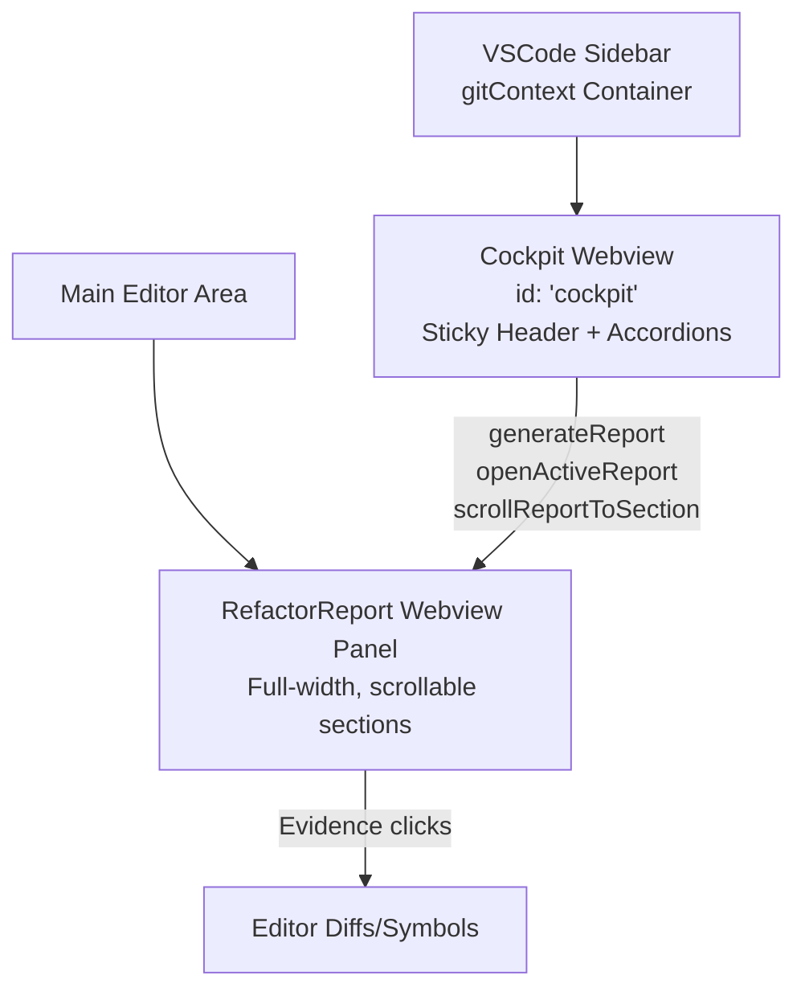

## Perfect UI End Goal: Cockpit Sidebar + Report Panel

### High-Level Vision
Replace fragmented tree views (`bundle`, `commits`, `symbols`, `reports`) with a single, unified **React Cockpit webview** in the `gitContext` sidebar container. Cockpit drives analysis pipelines (selection/last N/staged/unstaged), provides filtered lists/summaries, and navigates to a persistent **RefactorReport webview panel** in the main editor area for deep reading. Use [`src/types/cockpit.ts`](src/types/cockpit.ts) contracts as the single source of truth for state/messages/DTOs. Sidebar feels native/responsive; report remains full-width for evidence/details. Progress feels seamless via real-time updates; actions are snappy (local filters) with backend persistence.

**Key Principles**:
- **Cockpit**: Control surface (analyze, select, filter, summarize, quick-nav). No heavy content.
- **Report Panel**: Deep surface (full analysis output, scrollable sections: Overview/Incompleteness/Drift/Legacy/Timeline).
- **Native Feel**: Progress pills, virtualization for long lists, sticky header, cancel tokens, idempotent analysis.
- **Data Fidelity**: Commits/symbols/reports tagged with `scope`/`changeType`/`branch`/`pinned`; `hasMoreCommits` paging.

### Layout

- **Activation**: `onView:cockpit` + relevant `onCommand:*`.
- **Manifest**: `views: { "gitContext": [{ "id": "cockpit", "name": "Cockpit", "type": "webview" }] }` (trees deprecated post-parity).

### Cockpit UI Details (src/webview/cockpit/index.tsx)
**Sticky Header** (always visible):
- Context: `{repo} • {branch}`.
- Buttons: **Analyze** dropdown (`selection` | `lastN` | `staged` | `unstaged`), **Export JSON**, **Reset All**.
- Status Pill: `Bundle: 5c/32f/120s` | `Analyzing: symbols (40%)` [+ Cancel] | `Debt: 68%`.

**Accordions** (Commits & Selection | Active Bundle | Symbols | Saved Reports):
1. **Commits & Selection**:
   - Summary: `3 selected • 2 staged • 4 unstaged` [+ Filtered badge].
   - Controls: Select All Staged/Unstaged/Clear; Add SHA input.
   - Toggles: `[Staged] [Unstaged] [History]`; Last N (5/10/20).
   - Filter: Text (msg/SHA/file).
   - List: Checkbox | Short SHA/msg | Author/date | Changes | Icons (toggle bundle/diff). `Load more` if `hasMoreCommits`.
   
2. **Active Bundle**:
   - Summary: `5c/32f/120s • Debt: 68%` or `No bundle`.
   - Card: Counts/created.
   - Actions: Regenerate | Clear | Export | Open Report | Cancel (if analyzing).
   - Quick Links: Overview | Incompleteness | Drift | Legacy | Timeline → [`scrollReportToSection`](react-ui-contracts.md:280).

3. **Symbols**:
   - Summary: `42 symbols • kind=function,change=modified`.
   - Filters: Text | Kind (all/function/class/...) | Change (all/added/modified/removed).
   - List: Name | Path | Kind icon | Commit count | Last changed. Click: `openSymbolHistory`/`openSymbolInEditor`.

4. **Saved Reports**:
   - Summary: `5 reports • 2 pinned`.
   - Filters: Text | Branch dropdown | Pinned only.
   - List: Title/summary | Date | Branch | Pin icon.
   - Actions: Open | Regenerate | Delete | Toggle Pin.

**Optional**: Diagnostics accordion (errors/logs/config).

### Core Contracts ([`src/types/cockpit.ts`](src/types/cockpit.ts))
- **DTOs**: [`CommitDTO`](react-ui-contracts.md:8) (+`scope`/`analyzed`/`inBundle`), [`StagedFileDTO`](react-ui-contracts.md:20)/Unstaged, [`BundleSummaryDTO`](react-ui-contracts.md:30), [`SymbolDTO`](react-ui-contracts.md:42) (+`changeType`), [`ReportDTO`](react-ui-contracts.md:62).
- **State**: [`CockpitState`](react-ui-contracts.md:74) (repo/branch/activeSection/isAnalyzing/progress/selections/commits/staged/unstaged/bundle/symbols/reports/filters).
- **Messages**:
  - Host→Cockpit: `updateState` | `analysisProgress` | `focusSection`.
  - Cockpit→Host: Analysis (`generateReport`/`cancel`), Selections (`toggleCommit`/`selectAll*`), Bundle (`regenerate`/`openActiveReport`), Symbols (`openSymbol*`), Reports (`openReport`/`togglePin`), Filters/Setters, Nav (`scrollReportToSection`).

### Pipeline Integration
- **Modes**: Selection (selected commits/paths), Last N, Staged (diff-based symbols/edges/risks/blastRadius), Unstaged (+untracked).
- **Progress**: Emit steps (`scope/symbols/risks/llm`) + % via `CockpitHostMessage`.
- **Sync**: `syncCockpitState` assembles/enriches DTOs; `onDidChangeTreeData` triggers partial updates.
- **Commands**: `git-context.scrollToReportSection` bridges to report panel.

### Final Polish
- Perf: Virtualize lists, cap heights, sticky elements.
- UX: Empty states, preserve filters, force-reanalyze.
- Cleanup: Remove trees post-parity; update README/PROJECT for cockpit-first workflow.

This is the self-contained, production-ready end state: intuitive, performant, extensible.